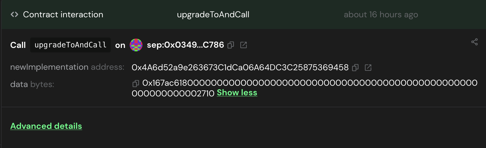

# Proposing Multisig Transactions via the Safe SDK

The [Safe SDK](https://github.com/safe-global/safe-core-sdk/blob/main/guides/integrating-the-safe-core-sdk.md) is being
used to propose transactions that only the Safe multisig admin wallet can perform. The proposer of these transactions is
also part of the multisig wallet but is used to orchestrate the process. E.g. If you require 3 of 5 trusted signers to
sign a transaction, then the multisig wallet should require 4 of 5 signers where the 4th signer is the orchestrator
wallet.

## Pre-requisites

- You have node installed
- Run `npm install` to install dependencies

## Set Permissioned Prover

To enable the permissioned prover on the light client contract, ensure that the following environment variables are set
in the `.env.contracts` file:

- `RPC_URL`
- `SAFE_ORCHESTRATOR_PRIVATE_KEY` (if not using a hardware wallet)
- `SAFE_MULTISIG_ADDRESS`
- `PERMISSIONED_PROVER_ADDRESS`
- `LIGHT_CLIENT_CONTRACT_PROXY_ADDRESS`
- `USE_HARDWARE_WALLET` (if yes, put "true", otherwise "false")

> **_NOTE:_** the signer for this transaction must be one of the signers in the **Safe Multisig Wallet**, whether the
> ledger hardware wallet or the address owned by `SAFE_ORCHESTRATOR_PRIVATE_KEY`

Assuming you're in the root folder, run the following command:

```bash
source .env.contracts && \
ts-node contracts/script/multisigTransactionProposals/safeSDK/modifyProverModeProposal.ts setProver
```

Open the URL shown in the console to sign the transaction in the Safe UI.

Once successful, all signers will see a transaction request on the SAFE UI e.g.
`https://app.safe.global/transactions/queue?safe=$SAFE_MULTISIG_ADDRESS`

Once the transaction has been signed by all signers and executed by one, you should be able to go to the light client
proxy and read the permissioned prover address on etherscan.

## Disable Permissioned Prover

To disable the permissioned prover on the light client contract, ensure that the following environment variables are set
in the `.env.contracts` file:

- `RPC_URL`
- `SAFE_ORCHESTRATOR_PRIVATE_KEY` (if not using a hardware wallet)
- `SAFE_MULTISIG_ADDRESS`
- `LIGHT_CLIENT_CONTRACT_PROXY_ADDRESS`
- `USE_HARDWARE_WALLET` (if yes, put "true", otherwise "false")

Assuming you're in the root folder, run the following command:

```bash
source .env.contracts && \
ts-node contracts/script/multisigTransactionProposals/safeSDK/modifyProverModeProposal.ts disableProver
```

Once successful, all signers will see a transaction request on the SAFE UI
`https://app.safe.global/transactions/queue?safe=$SAFE_MULTISIG_ADDRESS`

Once the transaction has been signed by all signers and executed by one, you should be able to go to the light client
proxy and read the permissioned prover address. It will be equal to the 0 ETH address (address(0)).

## Set the state history retention period

To enable the state history retention period on the light client contract, ensure that the following environment
variables are set in the `.env` file:

- `RPC_URL`
- `SAFE_ORCHESTRATOR_PRIVATE_KEY` (if not using a hardware wallet)
- `SAFE_MULTISIG_ADDRESS`
- `LIGHT_CLIENT_CONTRACT_PROXY_ADDRESS`
- `STATE_HISTORY_RETENTION_PERIOD`
- `USE_HARDWARE_WALLET` (if yes, put "true", otherwise "false")

Assuming you're in the root folder, run the following command:

```bash
source .env.contracts && \
ts-node contracts/script/multisigTransactionProposals/safeSDK/modifyStateHistoryRetentionPeriod.ts
```

Open the URL shown in the console to sign the transaction in the Safe UI.

Once successful, all signers will see a transaction request on the SAFE UI e.g.
`https://app.safe.global/transactions/queue?safe=$SAFE_MULTISIG_ADDRESS`

Once the transaction has been signed by all signers and executed by one, you should be able to go to the light client
proxy and read the state history retention period on etherscan.

## Set the epoch start block

To update the epoch start block in the light client v2 contract, ensure that the following environment variables are set
in the `.env` file:

- `RPC_URL`
- `SAFE_ORCHESTRATOR_PRIVATE_KEY` (if not using a hardware wallet)
- `SAFE_MULTISIG_ADDRESS`
- `LIGHT_CLIENT_CONTRACT_PROXY_ADDRESS`
- `EPOCH_START_BLOCK`
- `USE_HARDWARE_WALLET` (if yes, put "true", otherwise "false")

Assuming you're in the root folder, run the following command:

```bash
source .env.contracts && \
ts-node contracts/script/multisigTransactionProposals/safeSDK/modifyEpochStartBlock.ts
```

Open the URL shown in the console to sign the transaction in the Safe UI.

Once successful, all signers will see a transaction request on the SAFE UI e.g.
`https://app.safe.global/transactions/queue?safe=$SAFE_MULTISIG_ADDRESS`

Once the transaction has been signed by all signers and executed by one, you should be able to go to the light client
proxy and read the state history retention period on etherscan.

## Demonstrating the setPermissionedProver workflow

1. Follow the steps in the deployment script [readme](../../contracts/script/README.md) to set up a Multisig Wallet and
   deploy the Light Client contract
2. Set the environment variables mentioned in the section, [Set Permissioned Prover](#set-permissioned-prover)
3. Run the `ts-node` command as mentioned in the section, [Set Permissioned Prover](#set-permissioned-prover)

## Demonstrating the disablePermissionedProver workflow

1. Follow the steps in the deployment script [readme](../../contracts/script/README.md) to set up a Multisig Wallet and
   deploy the Light Client contract
2. Set the environment variables mentioned in the section, [Disable Permissioned Prover](#disable-permissioned-prover)
3. Run the `ts-node` command as mentioned in the section, [Disable Permissioned Prover](#disable-permissioned-prover)

## Approving Stake Amount to From Multisig to StakeTable

1. Set the following environment variables in `.env.contracts`

- RPC_URL
- SAFE_MULTISIG_ADDRESS
- TOKEN_CONTRACT_PROXY_ADDRESS
- STAKE_TABLE_CONTRACT_PROXY_ADDRESS

2. Run the script to propose the transaction the safe multisig address

```bash
source .env.contracts &&
ts-node contracts/script/multisigTransactionProposals/safeSDK/approveStake.ts $STAKE_AMOUNT_IN_ETHER
```

3. Follow the URL in the terminal output to the multisig wallet to sign the proposal and eventually execute it

## Staking to Validator from Multisig to StakeTable

1. Set the following environment variables in `.env.contracts`

- RPC_URL
- SAFE_MULTISIG_ADDRESS
- TOKEN_CONTRACT_PROXY_ADDRESS
- STAKE_TABLE_CONTRACT_PROXY_ADDRESS

2. Run the script to propose the transaction the safe multisig address

```bash
source .env.contracts &&
ts-node contracts/script/multisigTransactionProposals/safeSDK/delegateStake.ts $VALIDATOR_ADDRESS $STAKE_AMOUNT_IN_ETHER
```

3. Follow the URL in the terminal output to the multisig wallet to sign the proposal and eventually execute it

## Decoding Function Data

### Prerequisites

1. Node.js and npm: Ensure you have `Node.js` and `npm` installed on your system. You can download them from nodejs.org.
2. Project Setup: Make sure your project is set up correctly with all necessary dependencies installed. Run
   `npm install` in the project root to install dependencies.
3. Compiled Contract ABIs: Ensure that the contract ABIs are compiled and available in the out directory by running
   `forge build`. The script expects the ABI files to be located at out/<ContractName>.sol/<ContractName>.json. If this
   doesn't work, start a nix shell, `nix-shell` and then run the build command

### Usage

To decode proposal data using the `decodeFunctionData` script, follow these steps:

1. Assuming you're in the root folder
2. Run the script using the following command and ensure that the $CONTRACT_NAME and $ENCODED_DATA are set

```bash
   ts-node contracts/script/multisigTransactionProposals/safeSDK/decodeFunctionData.ts $CONTRACT_NAME $ENCODED_DATA
```

Expected Output: The script will output the function name and arguments decoded from the provided data. If there is an
error, such as an incorrect contract name or invalid encoded data, an error message will be displayed.

### Example Usage

Let's say you have a transaction proposal like this where some input data is encoded. This indicates that it's a
function call that has been encoded when the proposal to `upgradeToAndCall(...)` was triggered. You can check the
contract the proposal is interacting with for the $CONTRACT_NAME and copy the encoded data so that you can decode it
using this ts-node tool.



In this example, the command is:

```bash
ts-node contracts/script/multisigTransactionProposals/safeSDK/decodeFunctionData.ts LightClientV2 0x167ac6180000000000000000000000000000000000000000000000000000000000002710
```

And the result for the above is:

```bash
Function Name: updateEpochStartBlock
Arguments: 10000
Signature: updateEpochStartBlock(uint64)
Selector: 0x167ac618
```

## Testing

### Testing Safe Multisig Wallets

The Safe Transaction Service requires a live network available for testing and the current service only supports mainnet
and testnets such as Sepolia. The Safe Wallet UI only works with public networks that they support and to customize it
for a private EVM network, read their [docs](https://help.safe.global/en/articles/40795-supported-networks) for more
info. It's non-trivial to set up Safe for private networks and therefore time has not been allocated to do so at this
stage.

### Testing the utils

Testing safeSDK/utils.ts

```bash
yarn jest contracts/script/multisigTransactionProposals/tests/utils.test.ts
```

OR

```bash
yarn jest
```
